# Flowchart Module15 - Wash Column 2D Coupled

```mermaid
flowchart TD
    A["Demarrage macro"] --> B["Lire / creer WC15_Inputs"]
    B --> C["Calculer proprietes, debits, geometrie et maillage"]
    C --> D["Initialiser compacite, porosite et permeabilite locales"]
    D --> E["P1 = P1 utilisateur\nP2 = P2 utilisateur"]
    E --> F["Calculer rincage:\ncanaux, piston, lavage"]

    subgraph CPG["Boucle externe: consolidation couplee"]
        direction TB
        C0["Mettre a jour Qpores_transportes, vitesse plug et pression capillaire depuis la porosite locale haute"] --> C1["Reinitialiser les bornes de l'interface L2/L3"]

        subgraph L["Boucle interface L2/L3"]
            direction TB
            L0["Choisir hauteur L2/L3 courante"] --> L1["Activer seulement la partie du drain sous L2/L3"]
            L1 --> L2["Reprendre champ H = P + rho*g*z avec permeabilite locale"]

            subgraph P0["Boucle debit bas impose"]
                direction TB
                P00["Appliquer debit impose sur la couronne d'injection\nfond etanche ailleurs"] --> P01["P0 devient une pression resultante"]

                subgraph SOR["Boucle solveur pression SOR"]
                    direction TB
                    S0["Appliquer bords:\nP2 sommet, P1 drain, paroi externe etanche"] --> S1["Balayer les noeuds internes r-z\navec permeabilites aux faces"]
                    S1 --> S2["Reappliquer bord drain"]

                    subgraph BD["Boucle locale drain: chaque noeud drainant"]
                        direction TB
                        D0["Calculer hauteur active du noeud"] --> D1["Calculer deltaP trou"]
                        D1 --> D2["Bissection locale:\nDarcy radial local = debit admissible trous"]
                        D2 --> D3["Mettre a jour potentiel au bord drain"]
                    end

                    S2 --> BD
                    BD --> S3{"Variation H < tolerance ?"}
                    S3 -- "Non" --> S0
                end

                SOR --> P02["Reconstruire P statique et vitesses Darcy"]
                P02 --> P03["Integrer Qbas, Qhaut, Qdrain"]
                P03 --> P04{"Qbas = saumure entree ?"}
                P04 -- "Non" --> P00
            end

            P0 --> L3["Calculer saturation residuelle par capillarite/cavites"]
            L3 --> L4["Qpiegee_L3 = Qpores_transportes * saturation_residuelle"]
            L4 --> L5["Qdrain_cible = Qsaumure_entree + Qrincage_draine - Qpiegee_L3"]
            L5 --> L6{"Qdrain calcule = Qdrain cible ?"}
            L6 -- "Drain insuffisant" --> L7["Monter L2/L3"]
            L6 -- "Drain trop fort" --> L8["Descendre L2/L3"]
            L7 --> L0
            L8 --> L0
        end

        C1 --> L
        L --> C2["Calculer pression de pore moyenne et flux liquide vertical"]
        C2 --> C3["Calculer contrainte totale,\ntrainee hydraulique et contrainte effective"]
        C3 --> C4["Mettre a jour compacite:\nmax(bilan hydraulique, loi de consolidation)"]
        C4 --> C5["Mettre a jour porosite et permeabilite Kozeny-Carman"]
        C5 --> C6{"Variation compacite < tolerance ?"}
        C6 -- "Non" --> C0
    end

    F --> CPG
    CPG --> G["Couplage accepte ou iterations atteintes"]
    G --> H["Recalcul final des contraintes avec compacite retenue"]
    H --> I["Detecter L1/L2 par seuil de compacite couplee"]
    I --> J["Calculer pression interface:\nchamp 2D, hydrostatique liquide, poids apparent plug"]
    J --> K["Calculer salinite locale couplee a porosite et saturation"]
    K --> M["Calculer bilans et diagnostics"]
    M --> N["Ecrire feuilles WC15_*:\nchamps 2D, consolidation, zones, diagnostics"]
    N --> O["Fin macro"]
```

## Lecture Rapide

- La boucle externe `consolidation couplee` ferme maintenant compacite, porosite, permeabilite, contrainte effective et hydraulique.
- La permeabilite locale vient de Kozeny-Carman et varie avec la porosite locale.
- La contrainte effective combine `contrainte totale - pression de pore` et une contribution de trainee Darcy liee au flux relatif liquide/plug.
- La cible du drain retire la saumure piegee dans `L3`, calculee avec le debit de pores transporte par le plug couple.
- Le champ de salinite utilise maintenant la compacite et la porosite locales.
